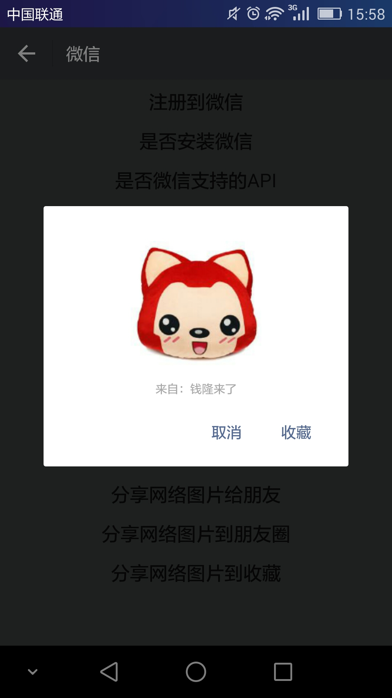
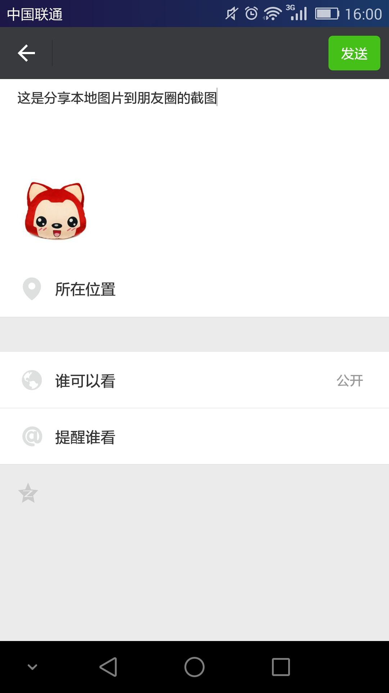
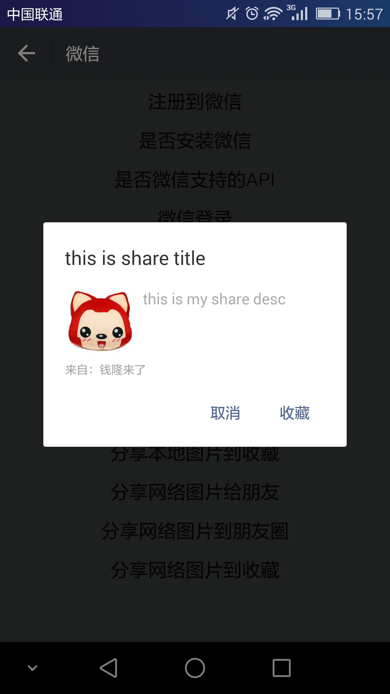
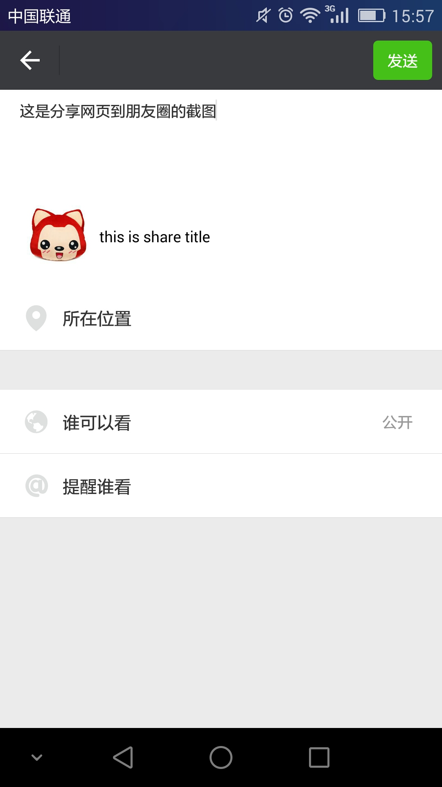

# react-native-wechat-android
react-native 的微信SDK辅助包，支持微信登录、微信分享、微信支付。

## [安装及使用方法 / Installation and How to use](./HELP.md)

## 提供以下方法 / Method

* [registerApp](#registerappappidcallback)
* [isWXAppInstalled](#iswxappinstalledcallbackerrcallback)
* [isWXAppSupportAPI](#iswxappsupportapicallbackerrcallback)
* [sendAuthReq](#sendauthreqoptionserrcallback)
* [sendLinkURL](#sendlinkurloptionserrcallback)
* [sendImage](#sendimageoptionserrcallback)
* [weChatPay](#wechatpayoptionserrcallback)

### registerApp(appId,callback)

appId : 在微信开放平台申请的AppID

callback : 返回注册结果(true/false)

使用示例：

```javascript
WeChatAndroid.registerApp(appId,(registerOK) => {
 ToastAndroid.show(registerOK + '',ToastAndroid.SHORT);
});
```

### isWXAppInstalled(callback,errCallback)

callback : 返回是否安装微信(true/false)

errCallback : 返回错误信息

使用示例：

```javascript
WeChatAndroid.isWXAppInstalled(
 (isInstalled) => {
    ToastAndroid.show(isInstalled + '',ToastAndroid.SHORT);
 },
 (err) => {
  ToastAndroid.show(err,ToastAndroid.SHORT);
 }
);
```

### isWXAppSupportAPI(callback,errCallback)

callback : 返回安装的微信是否为支持的版本(true/false)

errCallback : 返回错误信息

使用示例：

```javascript
WeChatAndroid.isWXAppSupportAPI(
 (isSupport) => {
  ToastAndroid.show(isSupport + '',ToastAndroid.SHORT);
 },
 (err) => {
  ToastAndroid.show(err,ToastAndroid.SHORT);
 }
);
```

### sendAuthReq(options,errCallback)

options : 微信登录需要的参数(可空)

errCallback : 返回错误信息

使用示例：

```javascript
var authOptions = {
 scope: 'snsapi_userinfo',
 state: 'SECRET'
};

WeChatAndroid.sendAuthReq(authOptions,(err) => {
 ToastAndroid.show(err,ToastAndroid.SHORT);
});

// 处理登录回调结果
DeviceEventEmitter.addListener('finishedAuth',function(event){
 var success = event.response.success;
  if(success){
   ToastAndroid.show(
    ' code = ' + JSON.stringify(event.response.code) + 
    ' state = ' + JSON.stringify(event.response.state),
    ToastAndroid.LONG
   );
  }else{
   ToastAndroid.show('授权失败',ToastAndroid.SHORT);
  }
});
```
or
```javascript
WeChatAndroid.sendAuthReq(null,(err) => {
 ToastAndroid.show(err,ToastAndroid.SHORT);
});

// 处理登录回调结果
DeviceEventEmitter.addListener('finishedAuth',function(event){
 var success = event.response.success;
  if(success){
   ToastAndroid.show(
    ' code = ' + JSON.stringify(event.response.code) + 
    ' state = ' + JSON.stringify(event.response.state),
    ToastAndroid.LONG
   );
  }else{
   ToastAndroid.show('授权失败',ToastAndroid.SHORT);
  }
});
```

### sendLinkURL(options,errCallback)

options : 微信分享网页需要的参数

errCallback : 返回错误信息

使用示例：

```javascript
var shareWebPageOptions = {
  link: 'https://github.com/beefe/react-native-wechat-android',
  tagName: 'test tagName',
  thumbSize: 150,
  title: 'this is share title',
  desc: 'this is my share desc',
  thumbImage: 'http://img1.imgtn.bdimg.com/it/u=3924416677,403957246&fm=21&gp=0.jpg',
};

WeChatAndroid.sendLinkURL(shareWebPageOptions,(err) => {
 ToastAndroid.show(err,ToastAndroid.SHORT);
});

// 处理分享回调结果
DeviceEventEmitter.addListener('finishedShare',function(event){
 var success = event.response.success;
 if(success){
  ToastAndroid.show('分享成功',ToastAndroid.SHORT);
 }else{
  ToastAndroid.show('分享失败',ToastAndroid.SHORT);
 }
});
```

### sendImage(options,errCallback)

options : 微信分享图片需要的参数

errCallback : 返回错误信息

使用示例：

分享本地图片：
```javascript
var shareLocalImageOptions = {
  imageSourceType: 0,
  thumbSize: 150,
  localPath: '/mnt/sdcard/temp.png',     // 此处改为你的本地图片路径
};

WeChatAndroid.sendImage(shareLocalImageOptions,(err) => {
 ToastAndroid.show(err,ToastAndroid.SHORT);
});

// 处理分享回调结果
DeviceEventEmitter.addListener('finishedShare',function(event){
 var success = event.response.success;
 if(success){
  ToastAndroid.show('分享成功',ToastAndroid.SHORT);
 }else{
  ToastAndroid.show('分享失败',ToastAndroid.SHORT);
 }
});
```

分享网络图片：(分享网络图片到朋友圈和收藏都会失败,具体原因待查,建议把网络图片下载到本地来分享)
```javascript
var shareRemoteImageOptions = {
  imageSourceType: 1,
  thumbSize: 150,
  scene: 0,
  remoteUrl: 'https://avatars3.githubusercontent.com/u/3015681?v=3&s=460',
};

WeChatAndroid.sendImage(shareRemoteImageOptions,(err) => {
 ToastAndroid.show(err,ToastAndroid.SHORT);
});

// 处理分享回调结果
DeviceEventEmitter.addListener('finishedShare',function(event){
 var success = event.response.success;
 if(success){
  ToastAndroid.show('分享成功',ToastAndroid.SHORT);
 }else{
  ToastAndroid.show('分享失败',ToastAndroid.SHORT);
 }
});
```

### weChatPay(options,errCallback)

options : [微信支付需要的参数](https://pay.weixin.qq.com/wiki/doc/api/app.php?chapter=9_12&index=2)

errCallback : 返回错误信息

使用示例：

```javascript
var payOptions = {
  appId: 'wx8888888888888888',         
  nonceStr: '5K8264ILTKCH16CQ2502SI8ZNMTM67VS',            
  packageValue: 'Sign=WXPay',
  partnerId: '1900000109',
  prepayId: 'WX1217752501201407033233368018',
  timeStamp: '1412000000',
  sign: 'C380BEC2BFD727A4B6845133519F3AD6',
};

WeChatAndroid.weChatPay(payOptions,(err) => {
 ToastAndroid.show(err,ToastAndroid.SHORT);
});

//  处理支付回调结果
DeviceEventEmitter.addListener('finishedPay',function(event){
 var success = event.response.success;
 if(success){
  // 在此发起网络请求由服务器验证是否真正支付成功，然后做出相应的处理
 }else{
  ToastAndroid.show('支付失败',ToastAndroid.SHORT);
 }
});
```

## Run Renderings
<center>
    
    
    
    
    
    
</center>

## [Demo download](./apk/demo.apk?raw=true)

## Notes
打包apk请参考[Generating Signed APK](http://facebook.github.io/react-native/docs/signed-apk-android.html#content)
